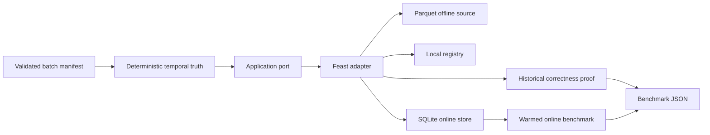

# #23 feature-store-lite

**Evidence status:** Docker benchmark reproduced in three identical runs; evidence is current.

**Proves:** point-in-time correct historical features, zero future leakage, TTL behavior, deterministic offline-to-online materialization, exact online values, and warmed Feast SDK latency.

**Primary benchmark:** online read p95 = **45.645578341645894 ms** (median of 3 runs; min 38.05 ms; max 53.02 ms), with **1,061.95 entity values/s**.

## Run

```bash
docker build -t feature-store-lite .
docker run --rm feature-store-lite
```

The default path is CPU-only, non-root, credential-free, and local-first. It creates a contract-valid deterministic batch, consumes its fail-closed manifest, writes a Parquet source, creates a local Feast registry and SQLite online store, then prints the complete benchmark JSON.

Run the full three-repetition publication harness with `./tools/benchmark.ps1`. It builds the image, records immutable image and wheel digests, aggregates in the pinned runtime, and emits Benchmark Result V2 evidence.

## Benchmark

The measured boundary contains only warmed `FeatureStore.get_online_features` calls. Registry cold load, materialization, correctness checks, fixture generation, and JSON writes are measured or verified separately.

| Metric | Current evidence | Gate |
|---|---:|---:|
| Online read p95 | 45.65 ms (median; min 38.05; max 53.02) | reported, not thresholded |
| Online throughput | 1,061.95 entity values/s (median) | reported, not thresholded |
| Point-in-time match | 100% in all 3 runs | 100% |
| Future leaks | 0 in all 3 runs | 0 |
| TTL violations | 0 in all 3 runs | 0 |
| Online value match | 100% in all 3 runs | 100% |
| Failures | 0 in all 3 runs | 0 |

A README number is promoted only from the median of at least three raw runs produced by the same immutable image and benchmark signature. This evidence satisfies that gate with source `10641d32af027761aec62c23b0586b3c1a10992f`, image `sha256:cf84e303a901636d32baf1900565425f261664a2ce0575267a4daf8b334224bc`, and wheel `sha256:eae158ceb9e9b1edbb02713025a4ca255ff776f7179b3ad5ac0be35d5efba5a9`. The aggregate and publication evidence are retained in `benchmarks/results/summary.json` and `benchmarks/publication/feature-store-v2.json`.

## What Is Proved

The fixture defines six daily snapshots per customer. It is first represented as a `validated-batch-manifest-v1` artifact compatible with #26, and its contract, artifact digest, row reconciliation, and path confinement are verified before Feast sees any row. Historical queries occur halfway through day three while day four and day five values already exist in the source. The independent oracle therefore expects snapshot three and detects any future value. Every eighth customer also has a query more than the two-day TTL after its newest snapshot and must return null.

After the historical proof, Feast materializes the source into SQLite. The benchmark verifies the newest eligible vector for every measured entity on the first read, every warmup, and every timed response.

## Architecture



The domain owns temporal truth and scoring. Feast is confined to one adapter. This keeps SOLID dependency inversion concrete: the application can run against an in-memory substitute, while Docker integration tests exercise the real engine.

## Why This Stack

- **Feast 0.64.0:** proven registry, point-in-time join, FeatureService, materialization, and online retrieval semantics.
- **Parquet:** deterministic local offline source with no service startup.
- **SQLite:** real Feast online store adequate for the single-process local latency claim.
- **Pandas and PyArrow:** fixture serialization and Feast result bridge only.
- **No FastAPI, Redis, Postgres, broker, Airflow, MLflow, Kumo, or cloud:** none improves the current acceptance proof.

A later repository can introduce Redis and a feature server when the claim becomes multi-process concurrency or network serving. That result must not be compared directly with this in-process SQLite benchmark.

## Repository Map

- `src/feature_store_lite/domain.py`: immutable features, temporal oracle, and scores.
- `src/feature_store_lite/application.py`: correctness and measurement orchestration.
- `src/feature_store_lite/ports.py`: narrow feature-store contract.
- `src/feature_store_lite/feast_adapter.py`: Feast, Parquet, registry, and SQLite boundary.
- `src/feature_store_lite/benchmark.py`: semantic evidence writer.
- `src/feature_store_lite/validated_batch.py`: fail-closed #26 manifest consumer.
- `contracts/`: versioned input and manifest contracts.
- `openspec/`: proposal, self-challenges, decisions, tasks, and verification.
- `sdd/`: accepted architecture, benchmark, and release contracts.

## Verification

CI builds the exact Docker path, lints the repository, runs pure and Feast integration tests with coverage, executes a short semantic benchmark, validates its JSON, and reruns the repository contract validator.

## References

All external behavior and version decisions are linked in [REFERENCES.md](REFERENCES.md).
