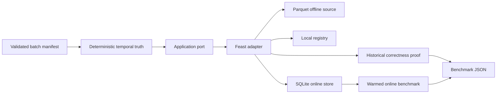

# Feature Store Lite: Point-in-Time Correct Features with Feast

**Zero future leaks and 100% point-in-time correctness** across three Docker runs, then warmed online reads at a median p95 of **45.65 ms** with **1,061.95 entity values/s** from a local Feast registry and SQLite online store.
Exact primary value: `online_read_latency_p95_ms=45.645578341645894` (median of 3 runs; min 38.05 ms; max 53.02 ms).

[](https://github.com/Brilhante29/feature-store-lite/actions/workflows/validate.yml)
[](LICENSE)


## Why this exists

The most expensive bug in applied machine learning is invisible in offline metrics: training on feature values that did not exist yet at prediction time. A model that saw tomorrow's balance looks brilliant in validation and fails in production. A feature store exists to prevent that, and to serve the same features online. This repository proves both properties with an independent oracle rather than trusting the framework:

- historical queries land halfway through day three while day four and five values already exist in the source, so any future leak is detected;
- every eighth customer is queried past the two-day TTL and must return null;
- the batch is verified (contract, digest, row reconciliation, path confinement) before Feast sees a row;
- after materialization, every online read is compared with the newest eligible vector, on the first read, every warm-up, and every timed response.

## Results

The measured boundary contains only warmed `FeatureStore.get_online_features` calls. Registry load, materialization, correctness checks, and fixture generation are measured or verified separately.

| Metric | Current evidence | Gate |
|---|---:|---:|
| Online read p95 | 45.65 ms (median; min 38.05; max 53.02) | reported, not thresholded |
| Online throughput | 1,061.95 entity values/s (median) | reported, not thresholded |
| Point-in-time match | 100% in all 3 runs | 100% |
| Future leaks | 0 in all 3 runs | 0 |
| TTL violations | 0 in all 3 runs | 0 |
| Online value match | 100% in all 3 runs | 100% |
| Failures | 0 in all 3 runs | 0 |

A README number is promoted only from the median of at least three raw runs from the same immutable image and benchmark signature.

## Quickstart

```bash
docker build -t feature-store-lite .
docker run --rm feature-store-lite
```

The default path is CPU-only, non-root, credential-free, and local-first. It creates a contract-valid deterministic batch, consumes its fail-closed manifest, writes a Parquet source, creates a Feast registry and SQLite online store, and prints the benchmark JSON.

Full three-repetition publication harness (PowerShell 7): `./tools/benchmark.ps1`. It records immutable image and wheel digests and emits Benchmark Result V2 evidence.

## How it works


```mermaid
flowchart LR
    T["Deterministic temporal truth"] --> P["Application port"]
    V["Validated batch manifest"] --> T
    P --> F["Feast adapter"]
    F --> O["Parquet offline source"]
    F --> R["Local registry"]
    F --> S["SQLite online store"]
    F --> H["Historical correctness proof"]
    S --> B["Warmed online benchmark"]
    H --> E["Benchmark JSON"]
    B --> E
```

The domain owns temporal truth and scoring; Feast is confined to one adapter. The application can run against an in-memory substitute, while Docker integration tests exercise the real engine.

| Module | Responsibility |
|---|---|
| `domain.py` | Immutable features, temporal oracle, scores |
| `application.py` | Correctness and measurement orchestration |
| `ports.py` | Narrow feature-store contract |
| `feast_adapter.py` | Feast, Parquet, registry, and SQLite boundary |
| `validated_batch.py` | Fail-closed consumer of the upstream batch manifest |
| `benchmark.py` | Semantic evidence writer |

## Design decisions

| Decision | Why | Rejected for now |
|---|---|---|
| Feast 0.64.0 | Proven registry, point-in-time join, FeatureService, materialization, online retrieval | A home-grown feature store |
| Parquet offline source | Deterministic, no service startup | A warehouse for a local proof |
| SQLite online store | Real Feast store, adequate for a single-process latency claim | Redis before multi-process serving is the question |
| Independent temporal oracle | Correctness is proven, not assumed from the framework | Trusting Feast's output |
| No API, broker, orchestration, or cloud | None improves the acceptance proof | Infrastructure for its own sake |

A Redis-backed feature server is the natural next step when the claim becomes multi-process or network serving, and its numbers must not be compared directly with this in-process benchmark.

## Limitations

- In-process SQLite reads: not a network-serving or concurrency benchmark.
- Synthetic daily snapshots; real event-time skew and late data are not modeled.
- Run-to-run spread (38.05 to 53.02 ms) reflects host noise at this scale.

## Reproducibility

- Source `10641d32af027761aec62c23b0586b3c1a10992f`, image `sha256:cf84e303a901636d32baf1900565425f261664a2ce0575267a4daf8b334224bc`, wheel `sha256:eae158ceb9e9b1edbb02713025a4ca255ff776f7179b3ad5ac0be35d5efba5a9`.
- Aggregate: [`benchmarks/results/summary.json`](benchmarks/results/summary.json); publication evidence: [`benchmarks/publication/feature-store-v2.json`](benchmarks/publication/feature-store-v2.json).
- CI builds the Docker path, lints, runs pure and Feast integration tests with coverage, executes a short semantic benchmark, and reruns the repository contract validator.

## Project structure

```text
src/feature_store_lite/   domain, application, ports, Feast adapter, batch consumer, benchmark
tests/                    pure and Feast integration tests
contracts/                versioned input and manifest contracts
benchmarks/  tools/       results, publication harness, validators
sdd/  openspec/           proposal, self-challenges, decisions, verification
```

## How this repository is built

The project follows the spec-driven workflow of [portfolio-reuse-kit](https://github.com/Brilhante29/portfolio-reuse-kit). Requirements and decisions live in [`sdd/`](sdd) and [`openspec/`](openspec), and [`project.yaml`](project.yaml) records the architecture, stack, and rejected alternatives. Development is AI-assisted and human-governed: [`AGENTS.md`](AGENTS.md) and [`CLAUDE.md`](CLAUDE.md) hold the coding-agent instructions, while tests, validators, and CI decide what gets published.

## Related work

- [data-quality-checks](https://github.com/Brilhante29/data-quality-checks): produces the validated batch manifest consumed here.
- [model-drift-detector](https://github.com/Brilhante29/model-drift-detector) and [mlops-end2end](https://github.com/Brilhante29/mlops-end2end): monitoring and lifecycle around the model that consumes these features.

All external behavior and version decisions are linked in [`REFERENCES.md`](REFERENCES.md).

## Author

**Guilherme Brilhante**, software engineer working on scalable backends and production AI.
[LinkedIn](https://www.linkedin.com/in/guilhermefreirebrilhanteseveriano/) · [GitHub](https://github.com/Brilhante29) · [Publications](https://dblp.org/pid/353/6812.html)

## License

[MIT](LICENSE).
